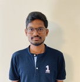

# Who am I?

- Name: Sushanthik Reddy Poreddy
- Mailid: ty99095@umbc.edu
- Mobile: (+1)4752679754

# Career Objective
# Educational Qualifications

 - Bachelor's Degree from JNTU-H 
    - College: Guru Nanak Institutions Technical Campus
    - Major: Computer Science and Technology
    - Year: 2016 to 2020
    - Marks Secured: 8.96 CGPA
 - Intermediate
    - College: Narayana Junior College
    - Stream: M.P.C.
    - Year: 2014 to 2016
    - Marks Secured: 95.5%
  - SSC
     - School: SPR School of Excellence
     - Marks Secured: 9.7 CGPA
# Projects Undertaken

 - Title: **Identification of Plant Disease using Image Processing Techniques**
    - Duration: 2 months
    - Team Size: 3
    - Description: The main objective of this project is to design a software which has the ability to scan the images of the leaf and give the health status of the leaf by checking the results with the data stored in the data base.
    - Individual Role: Wrote some part of the python code for Image Processing and wrote algorithms to predict the health status of the leaf using pre-processing techniques.
    
  - Title: **Pill Reminder**
    - Duration: 2 months
    - Team Size: 3
    - Description: The main objective of this project is to design a mobile application which provides the user with a afcility to add all the prescripted medicines within the app, and set the app to notify the user during the time of taking the medicines.
    - Individual Role: I took the responsibility of detecting and correcting the errors and also wrote the code for the front-end part of the application.

# Internship
  
  - **Intern, Gifteria Innovative Products and Services Private Limited( 3rd year of my bachelor's degree)**
   - Project Name: Web Development
   - We made changes to the exsisting back-end of part of the website so that the user can order or see the things that are present on the website easily. I made few changes at the front-end side and managed the orders at the back-end side. 

# Technical Skills

  - Programming languages: C,HTML, CSS, Basic Python
  - Database: DBMS,MYSQL
  - Tools: SQL Developer, Turbo C, Eclipse IDE, IDE Python

# Languages 

 - Telugu
 - English
 - Hindi
  
# Acheivements
 
  - I was awarded with 2nd price at state level badminton torunment.
  - I got selected as vice-captain for a house in my school.
  - I worked as treasurer for my college photography club.

# Social Activitiy

 - participated in the events that mainly concentrates on protecting and planting seeds of trees. 
 
# Hobbies & Interests

 - Cooking veg and Non Vegetarian food
 - Playing cricket and badminton
 - Listening to music
